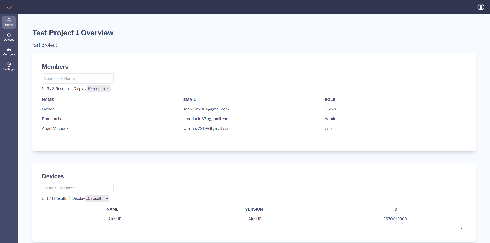
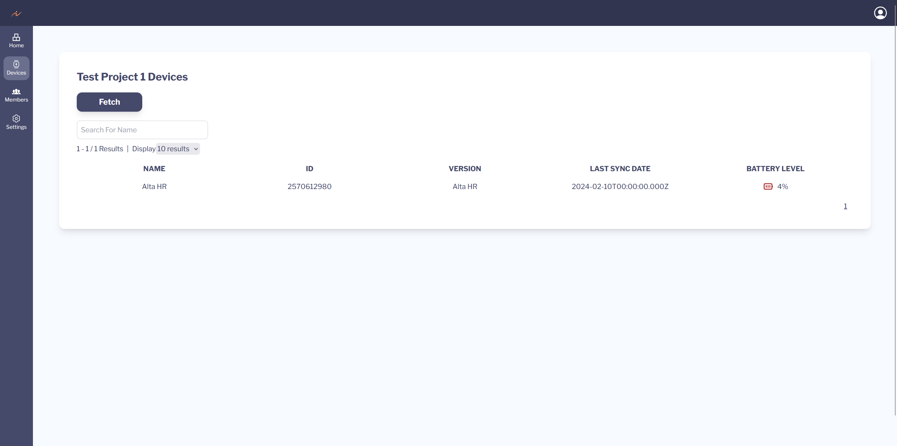
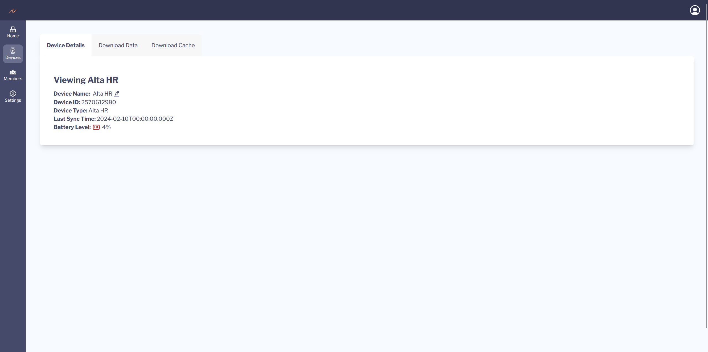
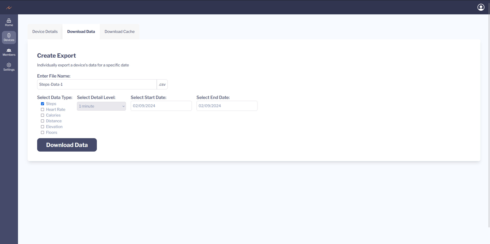
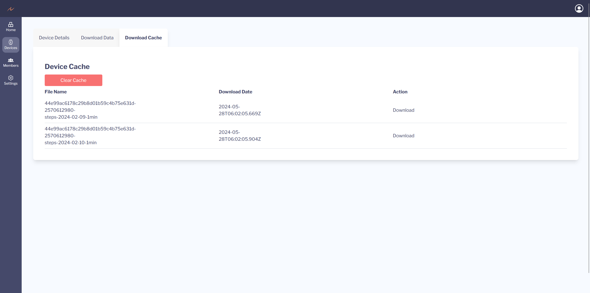
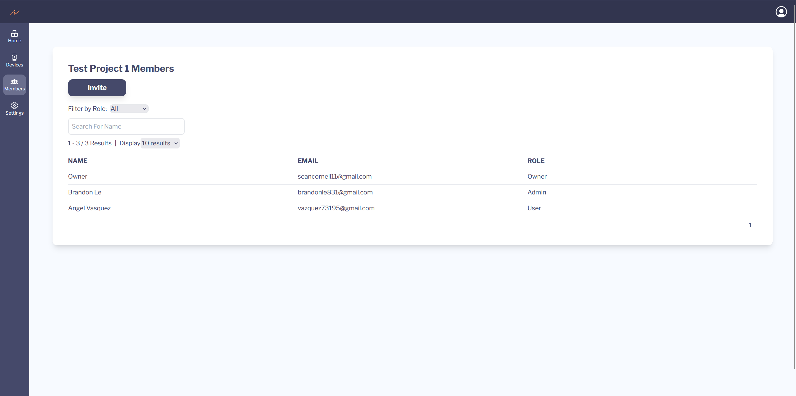
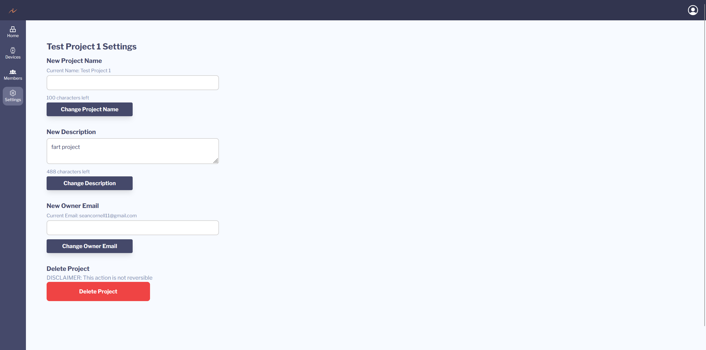

# Project Structure

This guide will help you understand a bit more about how projects work within Vitametrics. Please note that all of these pages are a WIP.

## **Overview Page**

The overview page is the first page you see when you access your project. It will display the project's name and description at the top of the page. It will also display an overview of the project's members and devices as seen below: 

## **Devices Page**

The device page is a collection of the devices that belong to the project. Each device has its own overview page with additional information.

### **Device Details Page**

This is an example of the device details page.

### **Download Data Page**

This is what the download data page looks like. It supports the generation and caching of multiple csv files. If multiple days are selected for download, a ZIP file will automatically be generated.

<figure markdown="span">
    
    <figcaption>Single-Day Download</figcaption>
</figure>

<figure markdown="span">
    
    <figcaption>Multi-Day Download</figcaption>
</figure>

### **Download Cache Page**

This is a list of all the the previously generated downloads you have for the device. They can be cleared using the "Clear Cache" button (**NOTE: This CANNOT be undone**) and you can download any of the previous csv's by clicking on the list items.

## **Members Page**

The members page provides an overview of all members of the project. Each member list item has its own information page where actions can be preformed on each member.

### **Member Overview Page**

This is an overview of the possible actions that can be done on a particular user. 

IMAGE WIP

## **Project Settings Page**

The project settings page contains information about the project that you can change.

